# 🔄 LMOVS Platform — Complete Usage Flow Guide

**Platform:** Legal Metrology Online Verification System  
**Purpose:** End-to-end digital verification, certification & lifecycle management of weighing/measuring instruments under the Legal Metrology Act, 2009

---

## Overview: The Big Picture

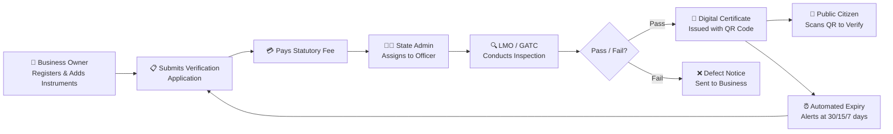

---

## 👥 The 6 Roles & What They Do

| Role | Who | What They Do |
|------|-----|-------------|
| **🏪 Business Owner** | Shopkeepers, traders, manufacturers | Register business + instruments, submit verification applications, pay fees, download certificates |
| **👨‍💼 State Admin** | Head of state Legal Metrology dept | Approve business registrations, assign applications to officers, monitor state compliance |
| **🔍 LMO** | Legal Metrology Officer (field inspector) | Conduct physical inspections, record test observations, issue certificates |
| **🏭 GATC** | Govt Approved Test Centre | Same as LMO — test specialized instruments and issue certificates |
| **🛡️ Super Admin** | Dept of Consumer Affairs (central govt) | National oversight, provision State Admins, manage master data, view national analytics |
| **📱 Public Citizen** | Any person | Scan QR codes to verify instrument certificates, file complaints/grievances |

---

## Flow 1: Business Owner Registration

> **Route:** `/register` → API: `POST /api/auth/register`

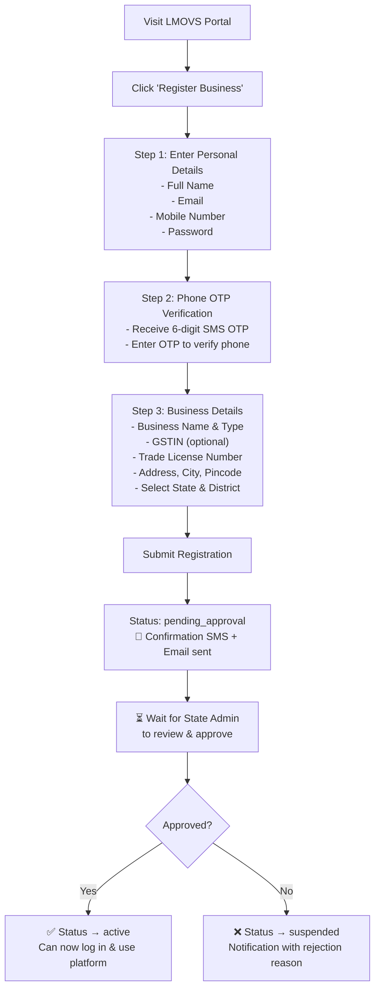

### What happens behind the scenes:
1. Password is hashed using PBKDF2 with a random salt (100,000 iterations)
2. User is created with role `business_owner` and status `pending_approval`
3. A linked `Business` profile record is created
4. A welcome notification is stored in-app
5. Email + SMS confirmation dispatched

---

## Flow 2: Instrument Registration

> **Route:** `/dashboard/instruments` → API: `POST /api/instruments`  
> **Who:** Business Owner (after approval)

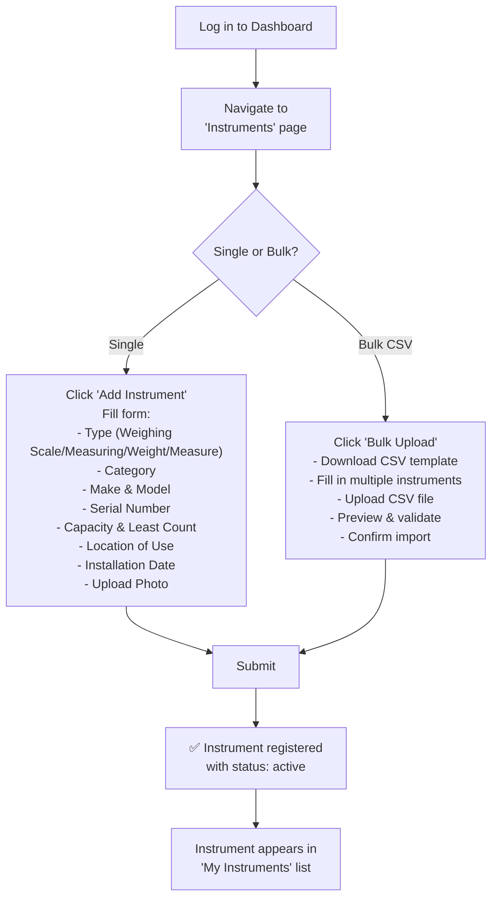

### Uniqueness enforced:
Each instrument is uniquely identified by the combination of `(businessId, serialNumber, model, make)`. Duplicates are rejected.

---

## Flow 3: Verification Application + Payment

> **Route:** `/dashboard/applications/new` → API: `POST /api/applications`  
> **Who:** Business Owner

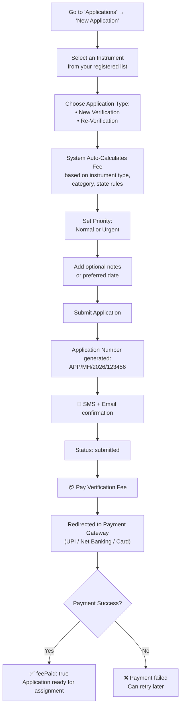

### Active application guard:
You cannot submit a new application for an instrument that already has an active application (submitted / assigned / scheduled / in_progress).

---

## Flow 4: State Admin — Approval & Assignment

> **Routes:** `/dashboard/state-admin/approvals`, `/dashboard/state-admin/applications`  
> **Who:** State Admin or Super Admin

### 4A: Approve Business Registrations

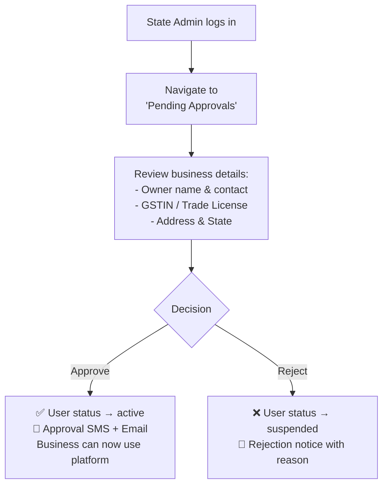

### 4B: Assign Applications to Officers

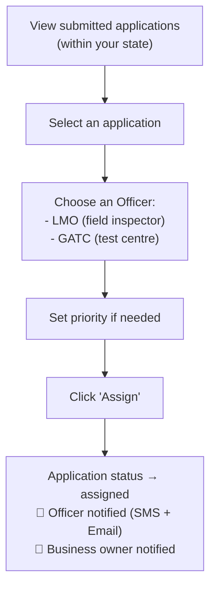

### 4C: Provision New Officers

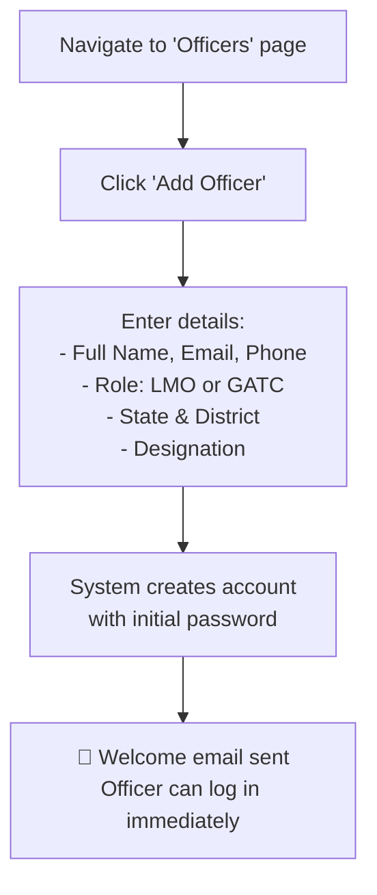

> **Note:** Only Super Admin can provision State Admins. State Admins can only provision LMOs/GATCs within their own state.

---

## Flow 5: LMO/GATC — Inspection & Certificate Issuance

> **Routes:** `/dashboard/lmo/schedule`, `/dashboard/lmo/verify`, `/dashboard/lmo/field-mode`  
> **Who:** LMO or GATC

### Step-by-Step Inspection Flow:

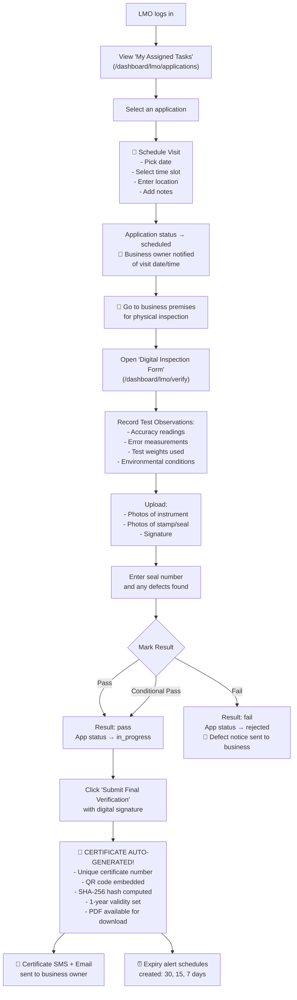

### Certificate Number Format:
```
{STATE_CODE}/{YEAR}/{INSTRUMENT_TYPE_CODE}/{SEQUENTIAL_NUMBER}
Example: MH/2026/WS/000042
```

---

## Flow 6: Public Certificate Verification

> **Route:** `/verify` (no login required)  
> **Who:** Any citizen

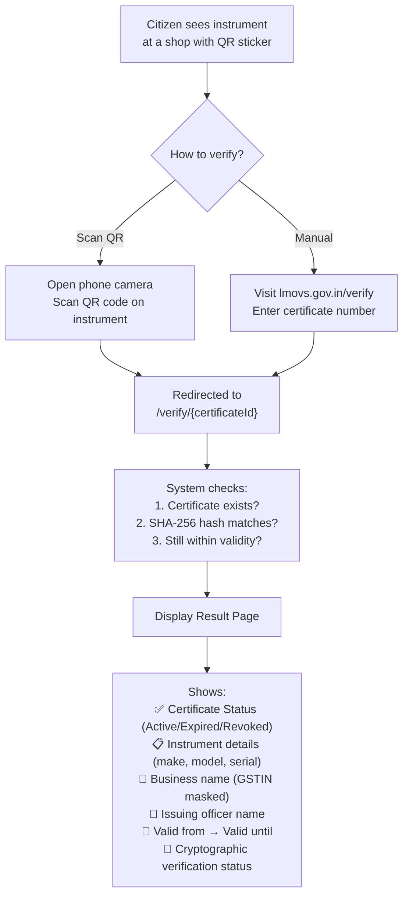

### What the public CANNOT see:
- Full GSTIN (masked as `22AA•••••ZA5`)
- Business owner's phone/email
- Internal application IDs
- Payment details

---

## Flow 7: Automated Expiry Alerts & Renewal

> **Trigger:** Daily cron job at `/api/cron/expiry-alerts`  
> **Who:** System (automated)

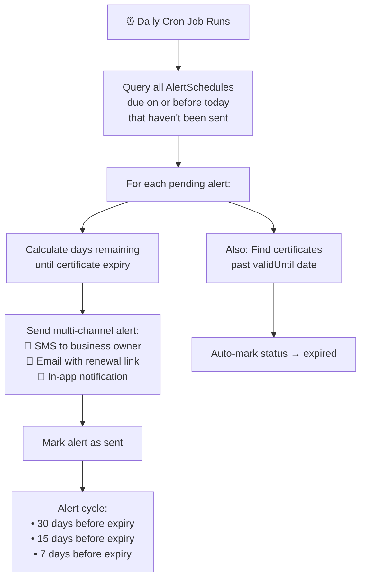

### Renewal Bridge:
The SMS/Email contains a **direct link** to submit a re-verification application:
```
/dashboard/applications/new?instrumentId={id}&type=re_verification
```
This pre-fills the form so the business owner can renew in 2 clicks.

---

## Flow 8: Grievance / Complaint Filing

> **Route:** `/complaints` (public, no login required)  
> **Who:** Any citizen or business owner

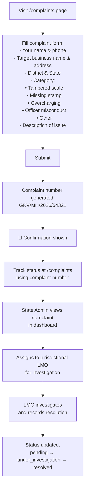

---

## Flow 9: Admin Monitoring & Analytics

> **Route:** `/dashboard` (role-specific views)

### What each role sees on their dashboard:

````carousel
### 🛡️ Super Admin Dashboard
- **National-level KPIs:** Total instruments, certificates, pending applications
- **State-wise compliance charts**
- **Application trends over time**
- **Verification outcome distribution (Pass/Fail/Conditional)**
- **System health & audit logs**
- **Master data management** (States, Districts, Fee structures)
- **User provisioning** (State Admins)

Quick Actions:
- View all states' performance
- Manage national fee schedules
- Access full audit trail
- Export national reports
<!-- slide -->
### 👨‍💼 State Admin Dashboard
- **State-level KPIs:** Instruments in state, pending approvals, active applications
- **District workload distribution chart**
- **Officer performance metrics**
- **Pending business registrations** queue

Quick Actions:
- Approve/reject business registrations
- Assign applications to officers
- Provision new LMOs/GATCs
- View state grievances
<!-- slide -->
### 🔍 LMO / GATC Dashboard
- **My Tasks:** Assigned applications count
- **Scheduled visits** for today/this week
- **Completed inspections** this month
- **Certificates issued** by me

Quick Actions:
- View assigned tasks
- Schedule inspection visit
- Open field mode (mobile-optimized)
- Submit inspection form
<!-- slide -->
### 🏪 Business Owner Dashboard
- **My Instruments:** Total count, active/inactive
- **Applications:** Submitted, in-progress, completed
- **Certificates:** Active, expiring soon, expired
- **Quick Stats:** Fee payments, upcoming renewals

Quick Actions:
- ➕ Add New Instrument
- 📤 Bulk Upload (CSV)
- 📋 Submit Verification Application
- 📜 Download Certificates
````

---

## Complete End-to-End Lifecycle

Here's the **entire lifecycle** of an instrument from registration to renewal, showing all roles involved:

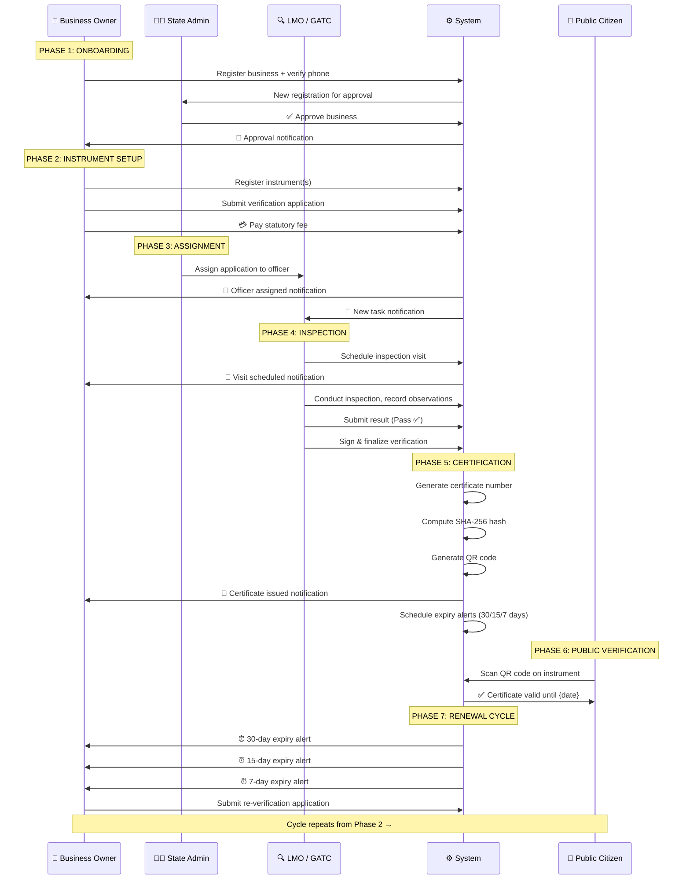

---

## URL Map — Where Everything Lives

| Page | URL | Role |
|------|-----|------|
| Home / Landing | `/` | Public |
| Login | `/login` | All |
| Register Business | `/register` | Public |
| Phone OTP Verify | `/verify-otp` | Public |
| Forgot Password | `/forgot-password` | All |
| Reset Password | `/reset-password` | All |
| **Dashboard** | `/dashboard` | All authenticated |
| My Instruments | `/dashboard/instruments` | Business Owner |
| Instrument Detail | `/dashboard/instruments/{id}` | Business Owner |
| Bulk Upload | `/dashboard/instruments/bulk` | Business Owner |
| My Applications | `/dashboard/applications` | All authenticated |
| New Application | `/dashboard/applications/new` | Business Owner |
| My Certificates | `/dashboard/certificates` | All authenticated |
| Profile | `/dashboard/profile` | All authenticated |
| **LMO Tasks** | `/dashboard/lmo/applications` | LMO |
| Schedule Visit | `/dashboard/lmo/schedule` | LMO |
| Inspection Form | `/dashboard/lmo/verify` | LMO |
| Field Mode | `/dashboard/lmo/field-mode` | LMO |
| **State Admin** | `/dashboard/state-admin/approvals` | State Admin |
| Assign Apps | `/dashboard/state-admin/applications` | State Admin |
| Manage Officers | `/dashboard/state-admin/officers` | State Admin |
| **Super Admin** | `/dashboard/admin/states` | Super Admin |
| Master Data | `/dashboard/master-data` | Super/State Admin |
| Audit Logs | `/dashboard/audit-logs` | Super Admin |
| Reports | `/dashboard/reports` | All authenticated |
| Global Search | `/dashboard/search` | All authenticated |
| Complaints (dashboard) | `/dashboard/complaints` | All authenticated |
| **Public Verify** | `/verify` | Public |
| Certificate Check | `/verify/{certificateId}` | Public |
| **Public Complaints** | `/complaints` | Public |
| Payment Gateway | `/payments/gateway/{applicationId}` | Business Owner |
