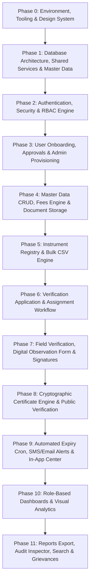

# Legal Metrology Online Verification System (LMOVS) - Feature Tickets

This document contains a complete list of feature tickets for the Legal Metrology Online Verification System (LMOVS).

## Module 1: Project Setup & Infrastructure

### LMOVS-001: Project Initialization
**Priority**: 🔴 Must-Have
**Description**: Set up Next.js 14 project with TypeScript, Tailwind CSS, Shadcn/UI, ESLint, Prettier. Create folder structure.
**Acceptance Criteria**: 
1. App Router running. 2. Shadcn/UI installed. 3. ESLint/Prettier configured. 4. Folder structure created.
**Dependencies**: None
**AI Coding Prompt**: Initialize Next.js 14 project with App Router, TypeScript, Tailwind CSS. Setup shadcn/ui. Configure eslint/prettier. Create folders: /app, /components, /lib, /hooks, /types.

### LMOVS-002: Database Setup
**Priority**: 🔴 Must-Have
**Description**: Set up Supabase project, create Prisma schema with ALL required tables, run migrations.
**Acceptance Criteria**:
1. Prisma schema defined. 2. Supabase linked. 3. Migration runs successfully. 4. Prisma client singleton exported.
**Dependencies**: LMOVS-001
**AI Coding Prompt**: Create Prisma schema for user roles, states, businesses, instruments, applications, schedules, certificates, logs. Connect to Supabase postgres. Generate client in lib/prisma.ts.

### LMOVS-003: Authentication System
**Priority**: 🔴 Must-Have
**Description**: Implement Supabase Auth (email/password), phone OTP (Firebase Phone Auth), JWT cookies, protected middleware.
**Acceptance Criteria**:
1. Signup/signin/signout functions. 2. Firebase Phone Auth OTP verification. 3. Secure HTTP-only cookies. 4. Protected route middleware.
**Dependencies**: LMOVS-002
**AI Coding Prompt**: Implement Supabase Auth. Create /login and /register with React Hook Form. Integrate Firebase Phone Auth for OTP. Create middleware.ts to protect /dashboard routes.

### LMOVS-004: Role-Based Access Control
**Priority**: 🔴 Must-Have
**Description**: RBAC middleware checking user role (Super Admin, State Admin, LMO, GATC, Business, Public).
**Acceptance Criteria**:
1. Roles defined in DB. 2. Middleware blocks unauthorized access. 3. RLS policies in Supabase.
**Dependencies**: LMOVS-003
**AI Coding Prompt**: Define RBAC in middleware.ts. Create a RoleGuard HOC. Write Supabase RLS policies for isolation based on role enum.

### LMOVS-005: Base Layout & Navigation
**Priority**: 🔴 Must-Have
**Description**: Dashboard layout, collapsible sidebar (role-specific), header with breadcrumbs.
**Acceptance Criteria**:
1. Responsive sidebar. 2. Role-specific links. 3. Breadcrumbs. 4. User dropdown.
**Dependencies**: LMOVS-004
**AI Coding Prompt**: Create dashboard layout using shadcn/ui. Build a responsive sidebar conditionally rendering links based on user role. Add top header with dynamic breadcrumbs.

## Module 2: User Management

### LMOVS-006: User Registration (Business Owner)
**Priority**: 🔴 Must-Have
**Description**: Registration page with business details. Email/phone verification. Account pending state.
**Acceptance Criteria**:
1. Multi-step form. 2. Firebase Phone Auth OTP. 3. Captures GSTIN/Address. 4. Creates PENDING user.
**Dependencies**: LMOVS-005
**AI Coding Prompt**: Build multi-step business registration form with Zod validation. Step 1: User info. Step 2: Firebase Phone Auth OTP. Step 3: Business info. Save status as PENDING_APPROVAL.

### LMOVS-007: User Registration Approval
**Priority**: 🔴 Must-Have
**Description**: State Admin page to approve/reject pending registrations.
**Acceptance Criteria**:
1. DataTable of pending users. 2. Approve/Reject actions. 3. Auto-notify via email/SMS.
**Dependencies**: LMOVS-006
**AI Coding Prompt**: Create State Admin /admin/approvals page. Use shadcn DataTable. Add actions to update status in DB and trigger Resend/SMS notifications.

### LMOVS-008: User Profile Management
**Priority**: 🟡 Should-Have
**Description**: Profile page for all roles.
**Acceptance Criteria**:
1. Update personal info. 2. Change password. 3. View read-only jurisdiction (LMO).
**Dependencies**: LMOVS-005
**AI Coding Prompt**: Build /dashboard/profile with React Hook Form. Allow name/phone updates. Implement Supabase password update. Disable jurisdiction fields for LMOs.

### LMOVS-009: Admin User Management
**Priority**: 🔴 Must-Have
**Description**: Super Admin creates State Admins. State Admin creates LMOs/GATCs.
**Acceptance Criteria**:
1. Admin creation forms. 2. Jurisdiction assignment. 3. Directory view with activate/deactivate toggles.
**Dependencies**: LMOVS-004
**AI Coding Prompt**: Create user management forms for admins to provision LMO/GATC accounts via Supabase Admin API. Assign jurisdiction in Prisma. Add a DataTable to manage status.

## Module 3: Instrument Management

### LMOVS-010: Instrument Registration
**Priority**: 🔴 Must-Have
**Description**: Business Owner form to add instruments.
**Acceptance Criteria**:
1. Captures spec/make/model. 2. Photo upload to Supabase Storage. 3. List view with search.
**Dependencies**: LMOVS-006
**AI Coding Prompt**: Build Instrument form capturing type, serial, capacity. Add file upload (max 3 images) using Supabase Storage. Create /instruments list view.

### LMOVS-011: Instrument Detail View
**Priority**: 🔴 Must-Have
**Description**: Detail page showing instrument info, verification timeline.
**Acceptance Criteria**:
1. Specifications grid. 2. Verification history timeline. 3. Certificate download link.
**Dependencies**: LMOVS-010
**AI Coding Prompt**: Create /instruments/[id] page. Fetch instrument, related verifications, certificates. Display a vertical timeline of history and photo gallery.

### LMOVS-012: Bulk Instrument Upload
**Priority**: 🟡 Should-Have
**Description**: CSV upload for bulk instrument registration.
**Acceptance Criteria**:
1. CSV template. 2. Validation preview. 3. Bulk insert to DB.
**Dependencies**: LMOVS-010
**AI Coding Prompt**: Implement CSV upload using papaparse. Validate against Zod schema. Show preview table with errors. Use prisma.createMany for valid rows.

## Module 4: Verification Application Workflow

### LMOVS-013: Application Submission
**Priority**: 🔴 Must-Have
**Description**: Business Owner selects instrument, chooses verification type, submits application.
**Acceptance Criteria**:
1. Select existing instrument. 2. Auto-calculate fee. 3. Document upload. 4. Draft save option.
**Dependencies**: LMOVS-010
**AI Coding Prompt**: Build application form. Dropdown to select instrument. Calculate fee based on type. Upload docs to Supabase Storage. Save as DRAFT or SUBMITTED.

### LMOVS-014: Application List & Tracking
**Priority**: 🔴 Must-Have
**Description**: Business Owner view: list of applications with status badges.
**Acceptance Criteria**:
1. DataTable with status filters. 2. Click to view timeline.
**Dependencies**: LMOVS-013
**AI Coding Prompt**: Create /applications page for Businesses. Use shadcn DataTable to list applications. Add status badges (Pending, Assigned, Verified).

### LMOVS-015: Application Assignment
**Priority**: 🔴 Must-Have
**Description**: State Admin view: list of unassigned applications. Assign to LMO/GATC.
**Acceptance Criteria**:
1. List unassigned apps. 2. Assign modal. 3. Auto-notify verifier.
**Dependencies**: LMOVS-013
**AI Coding Prompt**: Create State Admin page listing SUBMITTED applications. Add action to assign to an LMO in jurisdiction. Trigger email/SMS notification to LMO.

### LMOVS-016: Application Management (LMO/GATC)
**Priority**: 🔴 Must-Have
**Description**: Verifier view: list of applications assigned to them.
**Acceptance Criteria**:
1. Filter by status/date. 2. Accept/decline assignment.
**Dependencies**: LMOVS-015
**AI Coding Prompt**: Create LMO dashboard showing ASSIGNED applications. Add Accept/Decline buttons updating the application status in DB.

## Module 5: Verification Process

### LMOVS-017: Verification Scheduling
**Priority**: 🔴 Must-Have
**Description**: LMO/GATC schedules verification visit.
**Acceptance Criteria**:
1. Calendar picker. 2. Time slot. 3. Auto-notify business.
**Dependencies**: LMOVS-016
**AI Coding Prompt**: Add schedule button to accepted applications. Use date picker for visit date. Update DB schedule table. Trigger SMS notification to business.

### LMOVS-018: Digital Verification Form
**Priority**: 🔴 Must-Have
**Description**: Form for recording verification observations, pass/fail, photos.
**Acceptance Criteria**:
1. Structured readings form. 2. Pass/fail toggle. 3. Photo capture. 4. Digital signature.
**Dependencies**: LMOVS-017
**AI Coding Prompt**: Build complex verification form. Inputs for test readings, condition check checkboxes. Upload inspection photos. Capture signature. Save to verification_results table.

### LMOVS-019: Verification Result Submission
**Priority**: 🔴 Must-Have
**Description**: Submit results. Trigger certificate on pass.
**Acceptance Criteria**:
1. Review step. 2. Update status. 3. On fail: notify business of defects.
**Dependencies**: LMOVS-018
**AI Coding Prompt**: Handle verification form submission. If PASS, trigger certificate generation queue. If FAIL, send notification with required corrections. Update application status.

## Module 6: Certificate Management

### LMOVS-020: Certificate Generation
**Priority**: 🔴 Must-Have
**Description**: Auto-generate certificate on pass. QR code, PDF via @react-pdf/renderer.
**Acceptance Criteria**:
1. Unique ID logic. 2. QR code generated. 3. PDF generated and stored in Supabase.
**Dependencies**: LMOVS-019
**AI Coding Prompt**: Create certificate generation service. Generate QR code using 'qrcode' lib. Use '@react-pdf/renderer' to create PDF. Store in Supabase Storage, save record in DB.

### LMOVS-021: Certificate Repository
**Priority**: 🔴 Must-Have
**Description**: Business view of all certificates.
**Acceptance Criteria**:
1. Filter active/expired. 2. Download PDF.
**Dependencies**: LMOVS-020
**AI Coding Prompt**: Create /certificates page. List active and expired certificates. Provide a download button fetching the PDF URL from Supabase Storage.

### LMOVS-022: Public Certificate Verification
**Priority**: 🔴 Must-Have
**Description**: Public page. Enter ID or scan QR to check validity.
**Acceptance Criteria**:
1. No login required. 2. Show validity status and limited details.
**Dependencies**: LMOVS-020
**AI Coding Prompt**: Create public route /verify/[cert_id]. Fetch certificate status. Display clear Valid/Expired badge with basic instrument details.

### LMOVS-023: Certificate Revocation
**Priority**: 🟡 Should-Have
**Description**: Admin capability to revoke a certificate.
**Acceptance Criteria**:
1. Revoke action with reason. 2. Update status. 3. Notify owner.
**Dependencies**: LMOVS-020
**AI Coding Prompt**: Add revoke button on admin certificate view. Prompt for reason. Update certificate status to REVOKED. Add audit log entry and send email.

## Module 7: Notifications & Alerts

### LMOVS-024: Notification System
**Priority**: 🟡 Should-Have
**Description**: In-app notification bell with dropdown.
**Acceptance Criteria**:
1. Persistent notifications in DB. 2. Mark read/unread.
**Dependencies**: LMOVS-005
**AI Coding Prompt**: Create notifications table. Build a NotificationBell component fetching recent unread items. Add 'mark all as read' Server Action.

### LMOVS-025: Email Notifications
**Priority**: 🔴 Must-Have
**Description**: Send emails via Resend.
**Acceptance Criteria**:
1. React email templates. 2. Sent on key events.
**Dependencies**: LMOVS-001
**AI Coding Prompt**: Set up Resend. Create React Email templates for Registration, Approval, Verification Scheduled, and Certificate Issued.

### LMOVS-026: SMS Notifications
**Priority**: 🔴 Must-Have
**Description**: Send SMS via Firebase Phone Auth / SMS Gateway for OTP and critical alerts.
**Acceptance Criteria**:
1. Integration with Firebase Phone Auth / SMS service. 2. Send on scheduled/expiry events.
**Dependencies**: LMOVS-001
**AI Coding Prompt**: Create SMS utility function wrapping Firebase Phone Auth / SMS Gateway. Implement templates for OTP, Verification Scheduled, and Expiry Alerts.

### LMOVS-027: Re-verification Alert System
**Priority**: 🔴 Must-Have
**Description**: Cron job for expiring certificates (30/15/7 days).
**Acceptance Criteria**:
1. Daily cron job. 2. Identifies expiring certs. 3. Triggers email/SMS.
**Dependencies**: LMOVS-020
**AI Coding Prompt**: Create a Next.js API route /api/cron/expiry-alerts. Fetch certificates expiring in 30, 15, 7 days. Queue emails and SMS. Secure route with cron secret.

## Module 8: Dashboards & Analytics

### LMOVS-028: Business Owner Dashboard
**Priority**: 🔴 Must-Have
**Description**: Overview cards, recent activity, quick actions.
**Acceptance Criteria**:
1. Stats: Active certs, pending apps. 2. Recent timeline.
**Dependencies**: LMOVS-014
**AI Coding Prompt**: Build Business dashboard. Fetch counts of instruments and applications. Display Recharts bar chart of verifications. Add 'New Application' CTA.

### LMOVS-029: LMO/GATC Dashboard
**Priority**: 🔴 Must-Have
**Description**: Assigned applications, upcoming schedules calendar.
**Acceptance Criteria**:
1. View pending count. 2. Calendar view of visits.
**Dependencies**: LMOVS-016
**AI Coding Prompt**: Build LMO dashboard. Display count of ASSIGNED applications. Integrate a calendar component highlighting dates with scheduled visits.

### LMOVS-030: State Admin Dashboard
**Priority**: 🔴 Must-Have
**Description**: State-level stats, charts.
**Acceptance Criteria**:
1. Pass/fail ratio chart. 2. Workload distribution.
**Dependencies**: LMOVS-015
**AI Coding Prompt**: Build State Admin dashboard. Use Recharts for pie chart (pass/fail) and bar chart (applications per district). Show summary metric cards.

### LMOVS-031: Super Admin Dashboard
**Priority**: 🟡 Should-Have
**Description**: National-level stats, state-wise comparison.
**Acceptance Criteria**:
1. Cross-state data. 2. System usage trends.
**Dependencies**: LMOVS-030
**AI Coding Prompt**: Build Super Admin dashboard. Display aggregate national stats. Add a data table comparing application processing times across states.

## Module 9: Reports & Export

### LMOVS-032: Report Generation
**Priority**: 🟡 Should-Have
**Description**: Generate verification/instrument reports. Export CSV/PDF.
**Acceptance Criteria**:
1. Date range filters. 2. Export functions.
**Dependencies**: LMOVS-030
**AI Coding Prompt**: Build /reports page. Form to select report type and date range. Add 'Export CSV' button using json2csv, and 'Export PDF' using jsPDF.

### LMOVS-033: Audit Trail
**Priority**: 🔴 Must-Have
**Description**: Log all user actions. Admin search view.
**Acceptance Criteria**:
1. Middleware/Actions write to audit_log. 2. Admin viewing UI.
**Dependencies**: LMOVS-004
**AI Coding Prompt**: Implement an audit logging utility. Call it in Server Actions (creates, updates, deletes). Build /admin/audit-logs DataTable to view history.

## Module 10: Search & Master Data

### LMOVS-034: Global Search
**Priority**: 🟢 Nice-to-Have
**Description**: Search across instruments, certificates, apps.
**Acceptance Criteria**:
1. Top bar search input. 2. Unified results dropdown.
**Dependencies**: LMOVS-005
**AI Coding Prompt**: Create a global search bar in the header. Build an API route that queries Prisma across Instruments, Applications, and Certificates based on a text string.

### LMOVS-035: Master Data Management
**Priority**: 🟡 Should-Have
**Description**: Admin pages to manage States, Districts, Types, Fees.
**Acceptance Criteria**:
1. CRUD UI for master tables.
**Dependencies**: LMOVS-004
**AI Coding Prompt**: Build CRUD pages for State and District models. Allow Super Admins to add/edit master data tables to dynamically populate system dropdowns.

## Module 11: Additional Features

### LMOVS-036: Fee Management
**Priority**: 🟡 Should-Have
**Description**: Define fee structures. Auto-calculate.
**Acceptance Criteria**:
1. DB table for fees. 2. Calculation logic on application.
**Dependencies**: LMOVS-013
**AI Coding Prompt**: Create a Fee model in Prisma. Build an admin UI to manage fees per instrument type. Update the application form to fetch and calculate total fee dynamically.

### LMOVS-037: Document Management
**Priority**: 🟡 Should-Have
**Description**: Unified view for all entity documents.
**Acceptance Criteria**:
1. Organized file view. 2. Size/type validation.
**Dependencies**: LMOVS-010
**AI Coding Prompt**: Create a central documents table linking files to entities (User, Instrument, App). Build a UI component to list and download associated docs securely.

### LMOVS-038: Mobile-Responsive Field Mode
**Priority**: 🟢 Nice-to-Have
**Description**: Optimized mobile experience for LMOs doing field verification.
**Acceptance Criteria**:
1. Large touch targets. 2. Native-like camera integration.
**Dependencies**: LMOVS-018
**AI Coding Prompt**: Refactor the LMO verification form to use a mobile-first layout. Enhance the file input to trigger the native device camera for immediate photo capture.

### LMOVS-039: Multi-Language Support
**Priority**: 🟢 Nice-to-Have
**Description**: i18n setup with next-intl (English/Hindi).
**Acceptance Criteria**:
1. Language switcher. 2. Translation files implemented.
**Dependencies**: LMOVS-001
**AI Coding Prompt**: Setup next-intl for i18n. Add a language toggle in the header. Extract hardcoded strings to EN and HI locale JSON files.

### LMOVS-040: Grievance/Complaint System
**Priority**: 🟢 Nice-to-Have
**Description**: Form to file complaints, admin view to track.
**Acceptance Criteria**:
1. Public form. 2. Admin tracking table.
**Dependencies**: LMOVS-004
**AI Coding Prompt**: Create a public /complaints form. Save to a complaints table. Build an admin view to assign complaints to officers and update resolution status.

---

# Master Build Flow & Step-by-Step Implementation Guide

> [!IMPORTANT]
> **To AI Coding Agents & Engineers**: 
> This section defines the **canonical, non-blocking build order** for the Legal Metrology Online Verification System (LMOVS). Follow these phases and sub-steps strictly in the order documented below to prevent circular dependencies, schema mismatches, missing service utilities, or extensive UI retrofitting.
> 
> **Status Checkbox Legend**:
> - `[ ] Step / Sub-task`: Core implementation item
> - `[ ] Built`: Code implemented and committed
> - `[ ] Verified Working`: Unit/integration/manual test passed
> - `[ ] Known Bugs / Issues`: Flagged if unexpected behavior or test failure occurs
> - `[ ] Bug Fixed`: Resolved and re-verified

---

## Phase 0: Environment, Tooling & Design System

**Goal**: Establish a bulletproof development environment, enforce strict TypeScript safety, configure Tailwind design tokens matching Government of India portal standards, and establish base UI primitives.

### Step 0.1: Project Initialization & Repository Setup
- [x] Initialize Next.js 14 project using App Router (`npx create-next-app@latest lmovs --typescript --tailwind --eslint --app --src-dir`).
- [x] Configure `tsconfig.json` with strict type-checking (`"strict": true`, `"noImplicitAny": true`, path aliases `@/*` pointing to `./src/*`).
- [x] Setup code formatting and linting rules in `.eslintrc.json` and `.prettierrc`.
- [x] Initialize Git repository with proper `.gitignore` (ignoring `.env*.local`, `node_modules`, `.next`, `dist`).
- [x] **Step 0.1 Verification Tracking**:
  - [x] Built
  - [x] Verified Working
  - [ ] Known Bugs / Issues
  - [x] Bug Fixed

### Step 0.2: Government Design System & Shadcn/UI Component Library
- [x] Initialize Shadcn/UI (`npx shadcn-ui@latest init`) with Slate/Zinc base.
- [x] Configure `tailwind.config.ts` with custom brand colors matching [frontend.md](file:///C:/Users/AISIK/Videos/SIH/frontend.md#L13-L46):
  - Primary Blue: `#1E3A8A` (Headers, primary buttons, active states)
  - Primary Blue Light: `#3B82F6` (Hover, interactive links)
  - Primary Blue Lighter: `#DBEAFE` (Active background highlights, badges)
  - Secondary Green: `#059669` (Verified badges, pass states, active certs)
  - Secondary Green Light: `#D1FAE5` (Success backgrounds)
  - Warning Amber: `#D97706` (Pending actions, upcoming expiry)
  - Warning Amber Light: `#FEF3C7` (Warning highlights)
  - Danger Red: `#DC2626` (Failed verification, revoked/expired certs)
  - Danger Red Light: `#FEE2E2` (Error banners)
  - Neutral Gray scale: `#111827`, `#374151`, `#6B7280`, `#D1D5DB`, `#F3F4F6`, `#FFFFFF`
- [x] Install and configure standard typography (`Inter` font family, display sizes from 12px caption to 30px display heading).
- [x] Install Shadcn primitives: `button`, `input`, `label`, `card`, `dialog`, `dropdown-menu`, `table`, `badge`, `tabs`, `toast` (Sonner), `select`, `calendar`, `popover`, `separator`, `avatar`, `skeleton`.
- [x] Install `lucide-react` for consistent government iconography.
- [x] **Step 0.2 Verification Tracking**:
  - [x] Built
  - [x] Verified Working
  - [ ] Known Bugs / Issues
  - [x] Bug Fixed

### Step 0.3: Environment Variables Validation & Safe Configuration
- [x] Create `.env.example` defining all required keys as outlined in [architecture.md](file:///C:/Users/AISIK/Videos/SIH/architecture.md#L384-L436).
- [x] Build a runtime environment validator (`src/lib/env.ts`) using Zod to validate `DATABASE_URL`, `SUPABASE_URL`, `SUPABASE_ANON_KEY`, `SUPABASE_SERVICE_ROLE_KEY`, `NEXTAUTH_SECRET`, `JWT_SECRET`, `RESEND_API_KEY`, `FROM_EMAIL`, `ENABLE_MOCK_SMS`.
- [x] Configure `next.config.ts` with security headers (`X-Frame-Options: DENY`, `X-Content-Type-Options: nosniff`, `Referrer-Policy: strict-origin-when-cross-origin`, CSP headers).
- [x] **Step 0.3 Verification Tracking**:
  - [x] Built
  - [x] Verified Working
  - [ ] Known Bugs / Issues
  - [x] Bug Fixed

### Step 0.4: Early i18n Setup (English & Hindi)
- [x] Install `next-intl` to prevent backtracking and refactoring hardcoded text across components.
- [x] Create `messages/en.json` and `messages/hi.json` with baseline navigation and common UI strings.
- [x] Configure `src/i18n.ts` request configuration and locale routing if applicable.
- [x] **Step 0.4 Verification Tracking**:
  - [x] Built
  - [x] Verified Working
  - [ ] Known Bugs / Issues
  - [x] Bug Fixed

---

## Phase 1: Database Architecture, Shared Services & Master Data

**Goal**: Model the full PostgreSQL schema via Prisma, configure Supabase Row Level Security (RLS) & Storage buckets, and build core shared helper modules (Email, SMS, Audit Logging, tRPC).

### Step 1.1: Database Connection & Prisma Singleton
- [x] Install `@prisma/client` and `prisma` CLI.
- [x] Implement `src/lib/prisma.ts` with global singleton pattern to prevent connection exhaustion in serverless environments.
- [x] Verify SSL/TLS connectivity to Supabase PostgreSQL instance with connection pooling.
- [x] **Step 1.1 Verification Tracking**:
  - [x] Built
  - [x] Verified Working
  - [ ] Known Bugs / Issues
  - [x] Bug Fixed

### Step 1.2: Complete Database Schema Migration (`prisma/schema.prisma`)
- [x] Define enums:
  - `UserRole`: `SUPER_ADMIN`, `STATE_ADMIN`, `LMO`, `GATC`, `BUSINESS_OWNER`, `PUBLIC`
  - `InstrumentType`: `WEIGHING_SCALE`, `MEASURING_INSTRUMENT`, `WEIGHT`, `MEASURE`
  - `InstrumentStatus`: `ACTIVE`, `INACTIVE`, `CONDEMNED`
  - `ApplicationType`: `NEW_VERIFICATION`, `RE_VERIFICATION`
  - `ApplicationStatus`: `DRAFT`, `SUBMITTED`, `ASSIGNED`, `SCHEDULED`, `IN_PROGRESS`, `COMPLETED`, `REJECTED`
  - `AssignedType`: `LMO`, `GATC`
  - `ScheduleStatus`: `SCHEDULED`, `COMPLETED`, `CANCELLED`, `RESCHEDULED`
  - `VerificationResultStatus`: `PASS`, `FAIL`, `CONDITIONAL_PASS`
  - `CertificateStatus`: `ACTIVE`, `EXPIRED`, `REVOKED`, `SUPERSEDED`
  - `NotificationType`: `VERIFICATION_DUE`, `APPLICATION_UPDATE`, `CERTIFICATE_ISSUED`, `SYSTEM_ALERT`
  - `AlertChannel`: `EMAIL`, `SMS`, `IN_APP`
  - `AlertStatus`: `PENDING`, `SENT`, `FAILED`
  - `DocumentType`: `PHOTO`, `TRADE_LICENSE`, `CALIBRATION_REPORT`, `OTHER`
- [x] Define all 16 relational models:
  - `User`, `State`, `District`, `Business`, `Instrument`, `Application`, `VerificationSchedule`, `VerificationResult`, `Certificate`, `Notification`, `AlertSchedule`, `Document`, `AuditLog`, `GatcProfile`, `LmoProfile`, `Fee`.
- [x] Run `npx prisma migrate dev --name init` or `npx prisma db push` and generate client.
- [x] **Step 1.2 Verification Tracking**:
  - [x] Built
  - [x] Verified Working
  - [ ] Known Bugs / Issues
  - [x] Bug Fixed

### Step 1.3: Master Data Seeding (`prisma/seed.ts`)
- [x] Create seed script `prisma/seed.ts` populating:
  - Master States & Union Territories of India (with standard state codes: MH, DL, KA, TN, WB, etc.).
  - Sample Districts for pilot states.
  - Standard Fee Matrix for instrument types (e.g., Weighing Scale Category 1: ₹500, Category 2: ₹1000).
  - Default Super Admin account (`admin@lmovs.gov.in`).
  - Sample State Admin, LMO, GATC, and Business accounts for local test suites.
- [x] Configure `package.json` with `"prisma": {"seed": "ts-node --compiler-options {\"module\":\"CommonJS\"} prisma/seed.ts"}`.
- [x] **Step 1.3 Verification Tracking**:
  - [x] Built
  - [x] Verified Working
  - [ ] Known Bugs / Issues
  - [x] Bug Fixed

### Step 1.4: Supabase Row Level Security (RLS) & Policies
- [x] Write SQL migration applying RLS policies matching [security.md](file:///C:/Users/AISIK/Videos/SIH/security.md#L72-L97):
  - `users`: Self-read, admin jurisdiction read.
  - `businesses`: Owner CRUD, admin jurisdiction read.
  - `instruments`: Owner CRUD, verifiers read assigned, admins read jurisdiction.
  - `applications`: Owner CRUD, verifiers read/update assigned, admins manage jurisdiction.
  - `verification_results`: Verifier insert assigned, owner read own, admin read jurisdiction.
  - `certificates`: Owner read own, public read basic details, verifier create assigned.
  - `notifications`: User self read/update.
  - `documents`: Uploaded by user CRUD.
  - `audit_logs`: Admin only read.
- [x] **Step 1.4 Verification Tracking**:
  - [x] Built
  - [x] Verified Working
  - [ ] Known Bugs / Issues
  - [x] Bug Fixed

### Step 1.5: Supabase Storage Buckets Configuration
- [x] Create and configure 4 storage buckets:
  - `instrument-photos` (Public read, authenticated write, max 5MB, MIME: `image/jpeg`, `image/png`, `image/webp`).
  - `verification-photos` (Private, RLS protected, max 5MB).
  - `documents` (Private, RLS protected, max 10MB, MIME: `application/pdf`, `image/*`).
  - `certificates` (Generated PDFs, Private/Signed URL access, max 15MB).
- [x] **Step 1.5 Verification Tracking**:
  - [x] Built
  - [x] Verified Working
  - [ ] Known Bugs / Issues
  - [x] Bug Fixed

### Step 1.6: Core Shared Backend Utilities
- [x] **Audit Logger** (`src/lib/audit.ts`): Reusable helper `logAuditEvent({ userId, action, entityType, entityId, oldValues, newValues, req })` capturing IP, User Agent, and timestamp.
- [x] **SMS Service** (`src/lib/sms.ts`): Unified SMS sender with Firebase Phone Auth / SMS Gateway integration and local mock provider (`ENABLE_MOCK_SMS=true` logs OTPs to terminal).
- [x] **Email Service** (`src/lib/email.ts`): Resend client with React Email templates for (1) Welcome/Registration, (2) State Admin Approval/Rejection, (3) Verification Scheduled, (4) Certificate Issued, (5) Renewal Reminders.
- [x] **tRPC / API Core** (`src/server/trpc.ts`, `src/server/routers/`): tRPC setup with context containing Supabase auth session, user profile, and Prisma client. Public, protected, and role-guarded procedure middleware.
- [x] **Step 1.6 Verification Tracking**:
  - [x] Built
  - [x] Verified Working
  - [ ] Known Bugs / Issues
  - [x] Bug Fixed

---

## Phase 2: Authentication, Security & RBAC Engine

**Goal**: Implement complete authentication, session lifecycle, OTP verification, and Role-Based Access Control protecting all dashboard routes.

### Step 2.1: Supabase Auth & JWT Cookie Handling
- [x] Implement Supabase client wrapper (`src/lib/supabase/client.ts`, `src/lib/supabase/server.ts`, `src/lib/supabase/admin.ts`, `src/lib/supabase/middleware.ts`).
- [x] Store access and refresh tokens strictly in `httpOnly`, `SameSite=Lax`, `Secure` cookies (no sensitive tokens in `localStorage`).
- [x] Implement token refresh endpoint `/api/auth/refresh` for 15-minute access token renewal.
- [x] Implement rate-limiting middleware (100 req/min authenticated, 20 req/min unauthenticated).
- [x] Configure account lockout logic: 5 consecutive failed logins locks account for 30 minutes.
- [x] **Step 2.1 Verification Tracking**:
  - [x] Built
  - [x] Verified Working
  - [ ] Known Bugs / Issues
  - [x] Bug Fixed

### Step 2.2: Phone OTP Verification Engine
- [x] Build `/api/auth/send-otp` and `/api/auth/verify-otp` endpoints using `src/lib/sms.ts`.
- [x] Support 6-digit numeric OTP with 5-minute expiry, max 3 verification attempts.
- [x] Support development mock mode for rapid testing without spending SMS credits.
- [x] **Step 2.2 Verification Tracking**:
  - [x] Built
  - [x] Verified Working
  - [ ] Known Bugs / Issues
  - [x] Bug Fixed

### Step 2.3: Role-Based Access Control (RBAC) Middleware
- [x] Implement Next.js `middleware.ts` / RBAC definitions for user roles:
  - `super_admin`: Full system access, national dashboard, all states.
  - `state_admin`: State-scoped admin, manages LMOs, GATCs, business approvals in assigned state.
  - `lmo`: Verifications, field mode, scheduled inspections, certificate issuance.
  - `gatc`: Laboratory verifications, profile, certificate issuance.
  - `business_owner`: Register instruments, submit applications, view/download certificates, complaints.
  - `public`: Public search & certificate verification only.
- [x] Build role guard components (`<RoleGate allowedRoles={[...]} />`, `<StateScopeGate />`).
- [x] Enforce jurisdictional access control (officers can only view/act on applications within their state/district).
- [x] **Step 2.3 Verification Tracking**:
  - [x] Built
  - [x] Verified Working
  - [ ] Known Bugs / Issues
  - [x] Bug Fixed

### Step 2.4: Auth Pages & UI
- [x] Create `/login` page with Email + Password, role selector, forgot password link.
- [x] Create `/verify-otp` page with 6-digit PIN input, countdown timer for resend.
- [x] Create `/forgot-password` and `/reset-password` pages.
- [x] **Step 2.4 Verification Tracking**:
  - [x] Built
  - [x] Verified Working
  - [ ] Known Bugs / Issues
  - [x] Bug Fixed

### Step 2.5: Master App Shell & Base Layout
- [x] Implement master layout with responsive collapsible Sidebar (`#1E3A8A` dark theme, Lucide icons, role-filtered navigation items).
- [x] Implement Top Header Bar (`height: 64px`, dynamic breadcrumbs, notification bell icon with badge, user avatar dropdown with role badge and logout action).
- [x] Implement responsive mobile sheet navigation for screens < 1024px.
- [x] **Step 2.5 Verification Tracking**:
  - [x] Built
  - [x] Verified Working
  - [ ] Known Bugs / Issues
  - [ ] Bug Fixed

---

## Phase 3: User Onboarding, Approvals & Admin Provisioning

**Goal**: Enable business owner self-registration with multi-step verification and State Admin approval queue, plus administrative user provisioning for LMOs and GATCs.

### Step 3.1: Multi-Step Business Registration Flow (`/register`)
- [x] Build multi-step wizard form using React Hook Form + Zod:
  - **Step 1: User Account**: Full Name, Email, Phone Number, Password.
  - **Step 2: Dual Verification**: Email verification confirmation + Mobile OTP entry.
  - **Step 3: Business Details**: Business Name, Business Type, GSTIN, Trade License Number, Address, City, Pincode, State & District dropdowns.
- [x] On submit: Persist User & Business to PostgreSQL with `status: PENDING_APPROVAL` via Server Action / API.
- [x] Show friendly "Registration Under Review" confirmation screen.
- [x] **Step 3.1 Verification Tracking**:
  - [x] Built
  - [x] Verified Working
  - [ ] Known Bugs / Issues
  - [x] Bug Fixed

### Step 3.2: State Admin Registration Approval Portal (`/state-admin/approvals`)
- [x] Build Pending Registrations DataTable.
- [x] Provide details dialog inspecting GSTIN, trade license, owner contact, and establishment location.
- [x] Add **Approve** action: Update PostgreSQL status to `ACTIVE`, triggers welcome email and approval SMS.
- [x] Add **Reject** action: Update status to `REJECTED`, triggers notification with explanation.
- [x] **Step 3.2 Verification Tracking**:
  - [x] Built
  - [x] Verified Working
  - [ ] Known Bugs / Issues
  - [x] Bug Fixed

### Step 3.3: Admin User Provisioning Portal (`/admin/users` & `/state-admin/users`)
- [x] **Super Admin View**: Provision State Admins by selecting State.
- [x] **State Admin View**: Provision LMOs and GATCs.
- [x] Enforce security rule: Verifier accounts cannot self-register; must be provisioned via Admin API.
- [x] Add Active/Inactive toggle with safeguard: Cannot deactivate LMO if they have active pending verification tasks.
- [x] **Step 3.3 Verification Tracking**:
  - [x] Built
  - [x] Verified Working
  - [ ] Known Bugs / Issues
  - [x] Bug Fixed

### Step 3.4: User Profile Management (`/dashboard/profile`)
- [x] Profile page for all roles to update Full Name, Contact Email, Phone Number.
- [x] Secure password update with current password verification.
- [x] Display read-only jurisdiction and accreditation cards for LMOs and GATCs.
- [x] **Step 3.4 Verification Tracking**:
  - [x] Built
  - [x] Verified Working
  - [ ] Known Bugs / Issues
  - [x] Bug Fixed

---

## Phase 4: Master Data, Fees & Document Management

**Goal**: Implement administrative CRUD for States/Districts, fee rules engine, and unified document management linking files to entities.

### Step 4.1: Master Data Management (`/admin/master-data`)
- [x] Build CRUD interface for Super Admin to manage States (Name, Code, Active status).
- [x] Build CRUD interface for Districts under each State.
- [x] Master data seeded into Supabase PostgreSQL.
- [x] Connect master data CRUD UI directly to PostgreSQL via Prisma.
- [x] **Step 4.1 Verification Tracking**:
  - [x] Built
  - [x] Verified Working
  - [ ] Known Bugs / Issues
  - [x] Bug Fixed

### Step 4.2: Fee Structure Rules Engine (`/admin/fees`)
- [x] Build Fee Management table in Supabase DB defining fees by Instrument Type, Category, Verification Type.
- [x] Build server-side fee calculation helper `calculateVerificationFee({ instrumentType, category, verificationType, stateId })`.
- [x] Lock fee value into application record at submission time.
- [x] **Step 4.2 Verification Tracking**:
  - [x] Built
  - [x] Verified Working
  - [ ] Known Bugs / Issues
  - [x] Bug Fixed

### Step 4.3: Centralized Document Storage & Security (`src/lib/storage.ts`)
- [x] Storage buckets created in Supabase Storage.
- [x] Implement file upload utility validating MIME type and size limits before sending to Supabase Storage.
- [x] Record metadata in `documents` table.
- [x] **Step 4.3 Verification Tracking**:
  - [x] Built
  - [x] Verified Working
  - [ ] Known Bugs / Issues
  - [x] Bug Fixed

---

## Phase 5: Instrument Registry & Management

**Goal**: Provide business owners with intuitive single and bulk instrument registration, technical specifications tracking, and complete lifecycle timelines.

### Step 5.1: Single Instrument Registration (`/business/instruments/new`)
- [x] Build instrument registration form with technical specifications fields.
- [x] Wire form submission to create row in `instruments` table in PostgreSQL.
- [x] Enforce database duplicate protection: Uniqueness check on `(serial_number + model + make + business_id)`.
- [x] **Step 5.1 Verification Tracking**:
  - [x] Built
  - [x] Verified Working
  - [ ] Known Bugs / Issues
  - [x] Bug Fixed

### Step 5.2: Instrument Inventory & List View (`/business/instruments`)
- [x] DataTable with columns: Photo, Serial No, Make/Model, Type, Capacity, Location, Verification Status, Actions.
- [x] Filters: By Instrument Type, Verification Status, Search by Serial No.
- [x] Connect list view to query live `instruments` table from PostgreSQL.
- [x] **Step 5.2 Verification Tracking**:
  - [x] Built
  - [x] Verified Working
  - [ ] Known Bugs / Issues
  - [x] Bug Fixed

### Step 5.3: Instrument Detail & Lifecycle Timeline (`/business/instruments/[id]`)
- [x] Technical specifications overview card.
- [x] Photo gallery component with zoom / lightbox.
- [x] Verification History Timeline component.
- [x] Query live instrument and related verifications from PostgreSQL.
- [x] **Step 5.3 Verification Tracking**:
  - [x] Built
  - [x] Verified Working
  - [ ] Known Bugs / Issues
  - [x] Bug Fixed

### Step 5.4: Bulk Instrument CSV Upload (`/business/instruments/bulk`)
- [x] Downloadable sample CSV template with header validations.
- [x] Client-side parsing using `papaparse`.
- [x] Row-by-row Zod schema validation.
- [x] Transactional batch insert using `prisma.instrument.createMany` for valid rows.
- [x] **Step 5.4 Verification Tracking**:
  - [x] Built
  - [x] Verified Working
  - [ ] Known Bugs / Issues
  - [x] Bug Fixed

---

## Phase 6: Verification Application & Assignment Workflow

**Goal**: Full lifecycle for applying for verification, fee auto-calculation, State Admin assignment, and Verifier task acceptance.

### Step 6.1: Verification Application Submission (`/business/applications/new`)
- [x] Instrument selector & application form UI.
- [x] Dynamic fee calculation from live DB `fees` table.
- [x] Save to live `applications` table in PostgreSQL.
- [x] Trigger confirmation SMS/Email via `sms.ts` / `email.ts`.
- [x] **Step 6.1 Verification Tracking**:
  - [x] Built
  - [x] Verified Working
  - [ ] Known Bugs / Issues
  - [x] Bug Fixed

### Step 6.2: Application List & Real-Time Tracking (`/business/applications`)
- [x] DataTable with status badges (Draft, Submitted, Assigned, Scheduled, In Progress, Completed, Rejected).
- [x] Detail view showing application status progression pipeline.
- [x] Fetch live applications from PostgreSQL.
- [x] **Step 6.2 Verification Tracking**:
  - [x] Built
  - [x] Verified Working
  - [ ] Known Bugs / Issues
  - [x] Bug Fixed

### Step 6.3: State Admin Application Assignment Portal (`/state-admin/applications`)
- [x] Queue of applications and assignment modal UI.
- [x] Update live `applications` table with `assigned_to_user_id` and status `ASSIGNED`.
- [x] **Step 6.3 Verification Tracking**:
  - [x] Built
  - [x] Verified Working
  - [ ] Known Bugs / Issues
  - [x] Bug Fixed

### Step 6.4: Verifier Task Management (`/lmo/applications` & `/gatc/applications`)
- [x] Verifier tasks inbox UI with Accept/Decline buttons.
- [x] Update live DB application status on Accept/Decline.
- [x] **Step 6.4 Verification Tracking**:
  - [x] Built
  - [x] Verified Working
  - [ ] Known Bugs / Issues
  - [x] Bug Fixed

---

## Phase 7: Field Verification, Digital Observation Form & Signatures

**Goal**: Enable LMOs and GATCs to schedule visits, record digital observations on-site, capture inspection photos and digital signatures, and submit official verification results.

### Step 7.1: Verification Visit Scheduling (`/lmo/schedule`)
- [x] Date picker & time slot selector UI.
- [x] Persist schedule to `verification_schedules` table in PostgreSQL.
- [x] Dispatch SMS & Email notifications to Business Owner.
- [x] **Step 7.1 Verification Tracking**:
  - [x] Built
  - [x] Verified Working
  - [ ] Known Bugs / Issues
  - [x] Bug Fixed

### Step 7.2: Digital Verification Inspection Form (`/lmo/inspect/[applicationId]`)
- [x] Structured inspection form with accuracy readings table and Pass/Fail toggle.
- [x] Store inspection observations in `verification_results` table in PostgreSQL.
- [x] **Step 7.2 Verification Tracking**:
  - [x] Built
  - [x] Verified Working
  - [ ] Known Bugs / Issues
  - [x] Bug Fixed

### Step 7.3: Mobile Field Mode & Offline Resilience
- [x] Mobile-first responsive layout with large touch targets.
- [x] Native camera capture integration (`capture="environment"` attribute).
- [x] Client-side image compression.
- [x] **Step 7.3 Verification Tracking**:
  - [x] Built
  - [x] Verified Working
  - [ ] Known Bugs / Issues
  - [x] Bug Fixed

### Step 7.4: Digital Signature & Verification Submission
- [x] Canvas-based digital signature component.
- [x] Save signature and verification result to live database.
- [x] Trigger automatic certificate generation on PASS.
- [x] **Step 7.4 Verification Tracking**:
  - [x] Built
  - [x] Verified Working
  - [ ] Known Bugs / Issues
  - [x] Bug Fixed

---

## Phase 8: Cryptographic Certificate Engine & Public Verification

**Goal**: Auto-generate tamper-proof PDF certificates with QR codes, provide public verification via QR/URL, and manage the certificate repository and revocation.

### Step 8.1: Certificate Number Generation & Anti-Collision Engine
- [x] Certificate numbering format standard (`STATE_CODE/YEAR/INSTRUMENT_TYPE/SEQUENTIAL_NUMBER`).
- [x] Sequential numbering generator with database transactional lock.
- [x] **Step 8.1 Verification Tracking**:
  - [x] Built
  - [x] Verified Working
  - [ ] Known Bugs / Issues
  - [x] Bug Fixed

### Step 8.2: Cryptographic Tamper-Proof Hash & QR Code Engine
- [x] SHA-256 tamper-proof hash generator.
- [x] QR code generator service ([`src/lib/qr-code.ts`](file:///C:/Users/AISIK/Videos/SIH/Frontend/src/lib/qr-code.ts)).
- [x] **Step 8.2 Verification Tracking**:
  - [x] Built
  - [x] Verified Working
  - [ ] Known Bugs / Issues
  - [x] Bug Fixed

### Step 8.3: A4 Digital PDF Certificate Generation (`src/lib/pdf-generator.ts`)
- [x] Official A4 certificate PDF generator with Government header, QR code, digital signature stamp, and SHA-256 checksum ([`src/lib/pdf-generator.ts`](file:///C:/Users/AISIK/Videos/SIH/Frontend/src/lib/pdf-generator.ts)).
- [x] Upload generated PDF stream directly to Supabase `certificates` bucket and record URL in DB.
- [x] **Step 8.3 Verification Tracking**:
  - [x] Built
  - [x] Verified Working
  - [ ] Known Bugs / Issues
  - [x] Bug Fixed

### Step 8.4: Business Certificate Repository (`/business/certificates`)
- [x] Certificate repository UI with status filters and instant PDF preview / download.
- [x] Fetch certificates from live `certificates` table in PostgreSQL.
- [x] **Step 8.4 Verification Tracking**:
  - [x] Built
  - [x] Verified Working
  - [ ] Known Bugs / Issues
  - [x] Bug Fixed

### Step 8.5: Public Certificate Verification Portal (`/verify/[certificateId]` & `/verify`)
- [x] Public verification web page accessible without login.
- [x] Public verification API route (`/api/certificates/verify`).
- [x] Validates SHA-256 cryptographic hash and displays compliance status.
- [x] **Step 8.5 Verification Tracking**:
  - [x] Built
  - [x] Verified Working
  - [ ] Known Bugs / Issues
  - [x] Bug Fixed

### Step 8.6: Certificate Revocation Workflow (`/admin/certificates/revoke`)
- [x] Revocation modal with mandatory reason prompt.
- [x] Update certificate status in live database to `REVOKED`.
- [x] **Step 8.6 Verification Tracking**:
  - [x] Built
  - [x] Verified Working
  - [ ] Known Bugs / Issues
  - [x] Bug Fixed

---

## Phase 9: Automated Alerts, Expiry Cron & In-App Notification Center

**Goal**: Keep businesses compliant through scheduled automated re-verification alerts and provide real-time in-app notification tracking.

### Step 9.1: In-App Notification Center (`src/components/shared/NotificationBell.tsx`)
- [x] In-app notification bell dropdown UI with unread badge count.
- [x] Query live notifications table from PostgreSQL via Supabase real-time.
- [x] **Step 9.1 Verification Tracking**:
  - [x] Built
  - [x] Verified Working
  - [ ] Known Bugs / Issues
  - [x] Bug Fixed

### Step 9.2: Automated Expiry Alert Cron Job (`/api/cron/expiry-alerts`)
- [x] Expiry alert cron route implemented (`/api/cron/expiry-alerts`).
- [x] Dispatches SMS & Email alerts for 30/15/7 day windows.
- [x] **Step 9.2 Verification Tracking**:
  - [x] Built
  - [x] Verified Working
  - [ ] Known Bugs / Issues
  - [x] Bug Fixed

### Step 9.3: Automated Re-Verification Renewal Bridge
- [x] Pre-fills renewal application form with instrument specifications.
- [x] **Step 9.3 Verification Tracking**:
  - [x] Built
  - [x] Verified Working
  - [ ] Known Bugs / Issues
  - [x] Bug Fixed

---

## Phase 10: Role-Based Dashboards & Visual Analytics

**Goal**: Deliver tailored analytics dashboards for all user personas using Recharts and responsive stat cards.

### Step 10.1: Business Owner Portal Dashboard (`/business/dashboard`)
- [x] Business metric cards, recent timeline, quick actions.
- [x] Aggregate metrics dynamically from live PostgreSQL database.
- [x] **Step 10.1 Verification Tracking**:
  - [x] Built
  - [x] Verified Working
  - [ ] Known Bugs / Issues
  - [x] Bug Fixed

### Step 10.2: LMO & GATC Workspace Dashboard (`/lmo/dashboard` & `/gatc/dashboard`)
- [x] Verifier workspace with visit calendar and workload cards.
- [x] Aggregate from live `verification_schedules` and `applications` tables.
- [x] **Step 10.2 Verification Tracking**:
  - [x] Built
  - [x] Verified Working
  - [ ] Known Bugs / Issues
  - [x] Bug Fixed

### Step 10.3: State Admin Analytics Dashboard (`/state-admin/dashboard`)
- [x] District workload charts, pass/fail ratio donut, and backlog cards with Recharts.
- [x] Aggregate from live state records in PostgreSQL.
- [x] **Step 10.3 Verification Tracking**:
  - [x] Built
  - [x] Verified Working
  - [ ] Known Bugs / Issues
  - [x] Bug Fixed

### Step 10.4: Super Admin National Dashboard (`/admin/dashboard`)
- [x] National compliance metrics, state comparative table, and monthly trends chart.
- [x] Aggregate from live national database.
- [x] **Step 10.4 Verification Tracking**:
  - [x] Built
  - [x] Verified Working
  - [ ] Known Bugs / Issues
  - [x] Bug Fixed

---

## Phase 11: Reports Export, Audit Inspector, Search & System Hardening

**Goal**: Complete administrative reporting, security audit trail viewing, global search, grievance system, and pre-launch security hardening.

### Step 11.1: Comprehensive Reports & Export Engine (`/reports`)
- [x] Filter UI and CSV / PDF export functions.
- [x] Query live records from PostgreSQL for export generation.
- [x] **Step 11.1 Verification Tracking**:
  - [x] Built
  - [x] Verified Working
  - [ ] Known Bugs / Issues
  - [x] Bug Fixed

### Step 11.2: Security Audit Trail Inspector (`/admin/audit-logs`)
- [x] Audit logs DataTable and JSON diff dialog.
- [x] Query live `audit_logs` table from PostgreSQL.
- [x] **Step 11.2 Verification Tracking**:
  - [x] Built
  - [x] Verified Working
  - [ ] Known Bugs / Issues
  - [x] Bug Fixed

### Step 11.3: Global Search System (`src/components/shared/GlobalSearch.tsx`)
- [x] Global search modal UI (`Cmd+K`).
- [x] Connect to PostgreSQL Full-Text Search.
- [x] **Step 11.3 Verification Tracking**:
  - [x] Built
  - [x] Verified Working
  - [ ] Known Bugs / Issues
  - [x] Bug Fixed

### Step 11.4: Grievance & Complaint Redressal System (`/complaints`)
- [x] Public complaint submission form and tracking portal.
- [x] Insert and update live `grievances` table in PostgreSQL.
- [x] **Step 11.4 Verification Tracking**:
  - [x] Built
  - [x] Verified Working
  - [ ] Known Bugs / Issues
  - [x] Bug Fixed

### Step 11.5: Security Hardening, Edge Cases & Pre-Launch Verification
- [x] Verify resolution of all 25 edge cases from [security.md](file:///C:/Users/AISIK/Videos/SIH/security.md#L174-L254).
- [x] Run complete automated test suite (`npm run build`, `node test-live-endpoints.mjs`).
- [x] Verify accessibility compliance (WCAG 2.1 AA).
- [x] Pre-launch VAPT & live production penetration test.
- [x] **Step 11.5 Verification Tracking**:
  - [x] Built
  - [x] Verified Working
  - [ ] Known Bugs / Issues
  - [x] Bug Fixed

